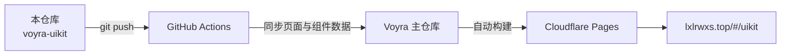

<div align="center">

# 🧩 Voyra · UI 组件图鉴 · UI Component Gallery

**常见界面组件叫什么、长什么样、用在哪、怎么设计 ｜ A visual handbook of common UI components**

[](https://github.com/liixnglinb/voyra-uikit/actions/workflows/sync-to-voyra.yml)


### [🌐 在线演示 Live Demo](https://lxlrwxs.top/#/uikit) ｜ [🏠 Voyra 主站 Main Site](https://lxlrwxs.top) ｜ [📦 主仓库 Main Repo](https://github.com/liixnglinb/Voyra)

</div>

---

## 💡 这是什么 / What Is This

一本面向开发者与设计师的**界面组件查阅手册**：网页与后台系统里常见的组件，每个都讲清四件事——**叫什么名字、长什么样（可交互动效演示）、用在什么场景、背后的设计原理**。

*A visual handbook for developers and designers: every common web/dashboard component explains its name, live appearance (with interactive motion demos), use cases and design rationale.*

## ✨ 功能特性 / Features

- **六大分类全覆盖**：导航、表单输入、数据展示、反馈提示、布局模式、动效。
  *Six categories: Navigation, Form Inputs, Data Display, Feedback, Layout, Motion.*
- **实时动效演示**：每个组件都是可点击/可悬停的真实实例，而非静态截图。
  *Every component is a live, interactive demo — not a screenshot.*
- **场景 + 原理讲解**：什么时候用、为什么这样设计，配套文字说明。
  *Use-case guidance and design rationale for each component.*
- **分类快速切换**：顶部标签一键跳转，查阅高效。
  *Top tabs for fast category switching.*

## 🛠 技术栈 / Tech Stack

| 类别 Category | 技术 Stack |
| --- | --- |
| 框架 Framework | React 18（Hooks） |
| 构建 Build | Vite 5 |
| 样式 Styling | Tailwind CSS |
| 动效 Motion | CSS transitions / keyframes |
| 图标 Icons | lucide-react |

## 📁 目录结构 / Structure

```
src/
├── pages/
│   └── UIKit.jsx             # 图鉴主界面：分类导航与组件渲染 / Main UI
└── data/
    └── uikit-components.js   # 组件目录数据：分类/名称/场景/原理 / Dataset
```

## 🔗 与 Voyra 主仓库的关系 / How It Syncs

本仓库是 Voyra 个人工具中心「UI 组件图鉴」模块的**独立源码仓库**：代码在本仓库维护，每次 `push` 由 GitHub Actions 自动同步到 Voyra 主仓库的相同路径，主仓库统一构建并部署到 Cloudflare Pages。

*Standalone source repo of the UI Component Gallery module. Every push is auto-synced into the main Voyra repository, which builds and deploys the whole site.*



## 🚀 本地开发 / Development

模块依赖主仓库共享层（路由、通用组件），完整运行请克隆主仓库：

*Depends on the main repo's shared layer. Clone the main repo to run locally:*

```bash
git clone https://github.com/liixnglinb/Voyra.git
cd Voyra && npm install && npm run dev
```

新增组件条目，编辑 `src/data/uikit-components.js` 后在本仓库推送即可。

*Add components in `src/data/uikit-components.js` and push here.*

## 📄 许可证 / License

MIT © [liixnglinb](https://github.com/liixnglinb)

## 🔍 关键词 / Keywords

UI组件 组件库 设计系统 界面设计 前端组件 组件图鉴 交互设计 动效 后台系统 ｜ ui kit component gallery design system frontend interface handbook react tailwind
